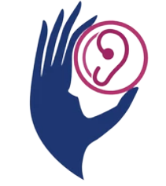

# Sign-Language-Translation

<!-- PROJECT LOGO -->
 

  

<h3 align="center">Sign Language Translation</h3>

  

    Sign Language Translation is an app that translates gestures into words and sounds in real time
     
    <a href="https://docs.google.com/presentation/d/1eXL84y_pzSWl21ZZ1IArxbnpbjQS35hfdgCSm2_B2_Q/edit?usp=sharing"><strong>View Demo »</strong></a>
     
  

<!-- TABLE OF CONTENTS -->

  
Table of Contents

  <ol>
    <li>
      <a href="#about-the-project">About The Project</a>
      <ul>
        <li><a href="#Scripts">Scripts</a></li>
      </ul>
    </li>
    <li><a href="#contact">Contact</a></li>
  </ol>

<!-- ABOUT THE PROJECT -->

## About The Project

Communication is one of the most essential aspects of human life as it allows us to express ourselves and connect with others. However, there are many individuals who face challenges in expressing their ideas and needs, specifically individuals with mutism, due to the lack of understanding of sign language by the majority of people. This motivated us to propose a feasible, affordable, and appropriate solution to facilitate communication with them.

Currently, communication with individuals with mutism is primarily through common signs or gestures, which can vary based on the context and region. Therefore, there is a need for an intermediary channel between individuals with mutism and those who struggle to fully understand their signs. Our idea is to develop Python scripts that can address this challenge.

(<a href="#top">back to top</a>)

### Scripts

The Sign-Language-Translation project consists of the following scripts:

- Data Collection: This script focuses on collecting sign language data, which will be used for training and development purposes. It involves capturing video or image data of sign gestures performed by individuals with mutism.

- Data Training: This script is responsible for training the machine learning model using the collected sign language data. It involves preprocessing the data, extracting relevant features, and training a model such as a deep learning neural network.

- Detection In Real Time: This script enables real-time detection and translation of sign gestures into corresponding words and sounds. It utilizes the trained machine learning model to recognize and interpret the sign gestures captured from a live video stream.

Each script is designed to perform a specific function in the sign language translation pipeline, contributing to the overall functionality of the application.

(<a href="#top">back to top</a>)

<!-- CONTACT -->

## Contact
For any inquiries or further information about the Sign-Language-Translation project, please feel free to reach out to:

[Elkanouni Samir](https://www.linkedin.com/in/samir-elkanouni-77b425223) 
Email: elkanouni.samir2019@gmail.com

(<a href="#top">back to top</a>)

