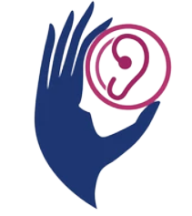

# Sign-Language-Translation

<!-- PROJECT LOGO -->
 

  

<h3 align="center">Sign Language Translation</h3>

  

    An app to translate gestures to words and sounds in real time
     
    <a href="https://docs.google.com/presentation/d/1eXL84y_pzSWl21ZZ1IArxbnpbjQS35hfdgCSm2_B2_Q/edit?usp=sharing"><strong>View Demo »</strong></a>
     
  

<!-- TABLE OF CONTENTS -->

  
Table of Contents

  <ol>
    <li>
      <a href="#about-the-project">About The Project</a>
      <ul>
        <li><a href="#Scripts">Scripts</a></li>
      </ul>
    </li>
    <li><a href="#contact">Contact</a></li>
  </ol>

<!-- ABOUT THE PROJECT -->

## About The Project

La communication est l’une des choses les plus nécessaire
dans la vie de l’être humain, tant qu’elle nous permet
d’exprimer et communiquer avec l’autre, or il existe
plusieurs gens qui n’arrivent pas à exprimer leurs idées et
besoins, spécifiquement les mutismes, vu l’ignorance du
langage de signe par la majorité des gens. Ce qui nous a
amené à proposer une solution réalisable, abordable,
convenable, afin de communiquer facilement avec eux.

En effet, la communication avec les mutismes ne se fait
que par des signes ou des gestes communs qui diffèrent
selon le contexte et la région.
Alors, il faut un canal intermédiaire entre les mutismes et
les gens qui n’arrivent pas à bien maîtriser leurs signes.
Notre idée est de réaliser des scripts en python qui
peuvent gérer cette problématique.

(<a href="#top">back to top</a>)

### Scripts

-  Data Collection
-  Data Training
-  Detection In Real Time

(<a href="#top">back to top</a>)

<!-- CONTACT -->

## Contact

[Elkanouni Samir](https://www.linkedin.com/in/samir-elkanouni-77b425223) - elkanouni.samir2019@gmail.com

(<a href="#top">back to top</a>)

